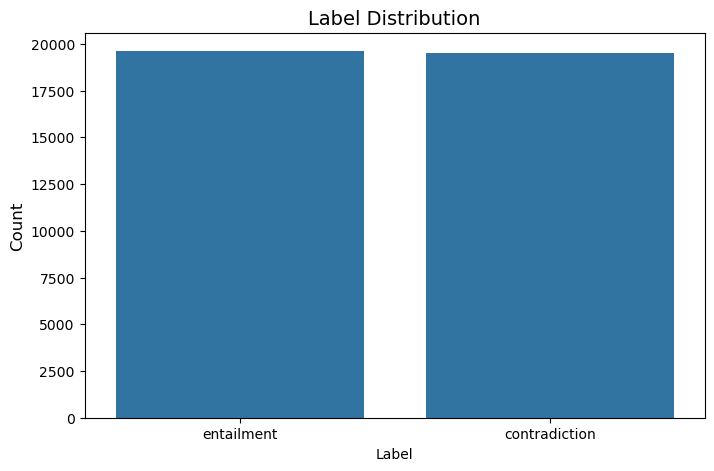
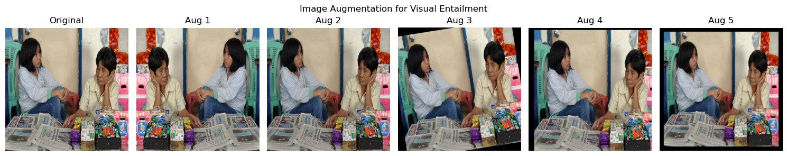
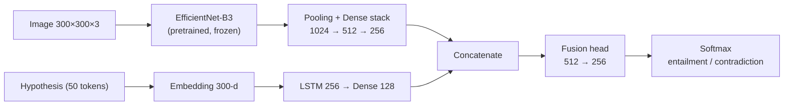
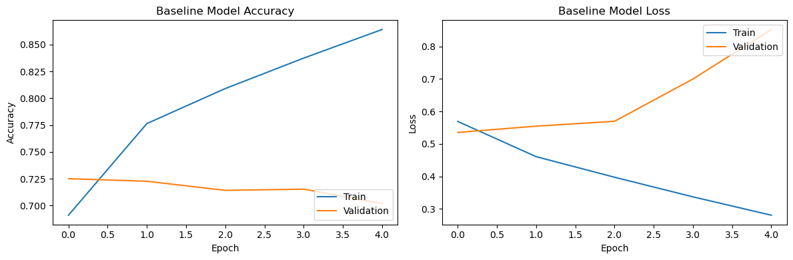
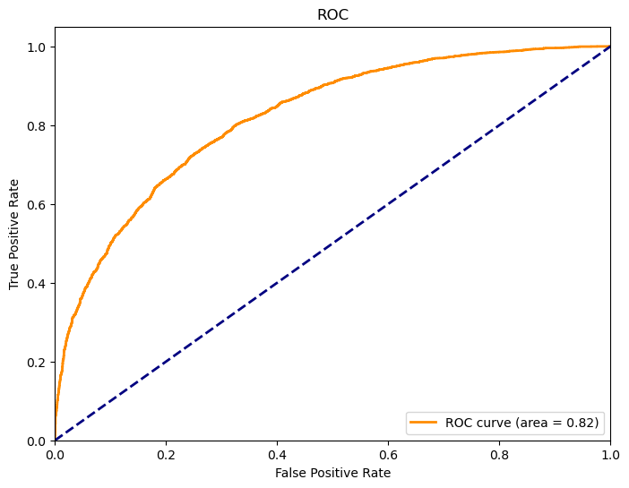
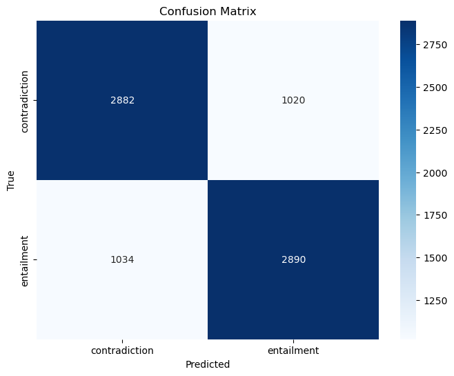
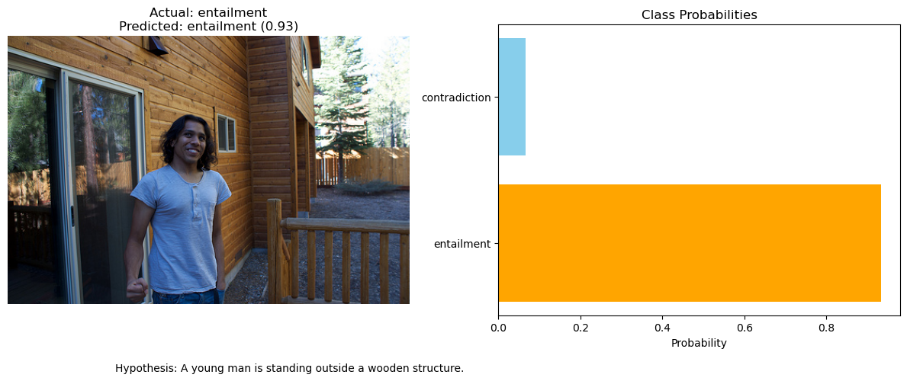
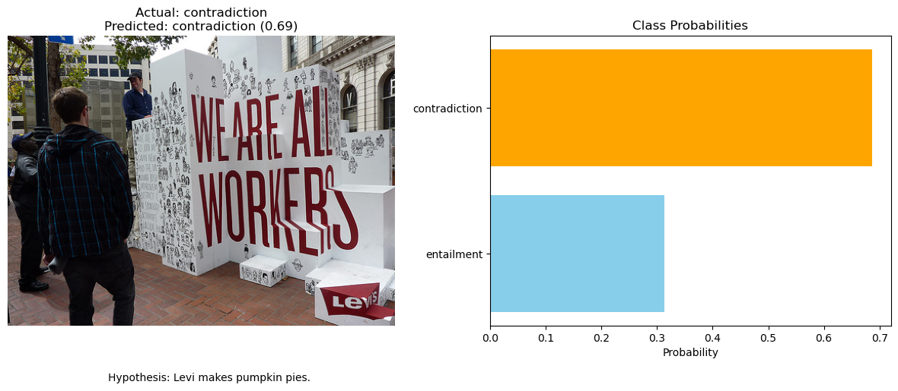

# Multimodal Deep Learning for Visual Entailment

A multimodal deep learning system that decides whether a natural-language hypothesis is entailed by, or contradicts, a given image - fusing a pretrained EfficientNet-B3 vision backbone with an LSTM text encoder in a single jointly trained network.

> Developed as part of **Deep Learning** (Jul - Nov 2025 | Semester 2, 2025) in the Master of Artificial Intelligence at RMIT University.

## Overview

Visual Entailment is a fine-grained image-text reasoning task: given an image (the *premise*) and a sentence (the *hypothesis*), the model must determine the semantic relationship between them. Unlike standard image classification, this requires the network to jointly understand visual content and language, and to reason about whether the sentence is actually supported by what the image shows. This project builds an end-to-end multimodal pipeline that takes an image-hypothesis pair as input and predicts one target:

| Target | Type   | Classes                    |
| ------ | ------ | -------------------------- |
| Label  | Binary | entailment / contradiction |

The final solution combines a **frozen, ImageNet-pretrained EfficientNet-B3 backbone** (KerasHub) for visual features with a **trainable embedding + LSTM branch** for the hypothesis text, fused through regularized dense layers - allowing strong visual representations to be reused while the language and fusion components are learned from the task data.


## Methodology

### 1. Exploratory Data Analysis

- Loaded 39,129 annotated image-hypothesis pairs and inspected structure, sample rows, and missing values (none found).
- Class distribution analysis showed the two labels are almost perfectly balanced (imbalance ratio 1.01).
- Image integrity verification over sampled files to detect missing or corrupted images before training.



### 2. Data Pre-processing

- **Images**: converted BGR → RGB, resized to 300×300, and scaled to [0, 1], with identical preprocessing applied at training, evaluation, and inference time.
- **Text**: hypotheses tokenized with a vocabulary fitted on the training split, converted to integer sequences, and padded to 50 tokens; token IDs are clipped to a safe vocabulary bound to keep the embedding layer stable across weight saving and reloading.
- **Class imbalance handling**: balanced (inverse-frequency) class weights computed from the training labels and applied to the loss as a safeguard, despite the near-balanced distribution.
- **Data augmentation**: horizontal flips, brightness jitter (±20%), small rotations (±10°), shifts (±10%), and zoom (0.9-1.1×) - light, label-preserving transforms that improve generalization without changing scene semantics.
- **Custom data generator**: a Keras `Sequence` that streams synchronized image-text batches from disk, keeping memory usage flat across the 39k-pair dataset.



### 3. Evaluation Framework

- **Stratified splits**: 64% train / 16% validation / 20% test, stratified by label so every partition preserves class proportions; the test set is evaluated once, on the final model only.
- **Metrics**: accuracy, macro-averaged precision, recall and F1-score (all classes weighted equally), per-class classification reports, confusion matrices, and ROC curves with AUC - with a pre-registered performance target of **macro-F1 ≥ 0.74** on the held-out test set.

### 4. Model Development

Two architectures were developed iteratively, each justified by data analysis and performance evidence:

| Model                                    | Description                                                                                                                                                                                                                                       |
| ---------------------------------------- | ------------------------------------------------------------------------------------------------------------------------------------------------------------------------------------------------------------------------------------------------- |
| **EfficientNet-B3 + LSTM (Baseline)**    | Frozen EfficientNet-B3 backbone → global average pooling → Dense(128) on the image side; 100-d embedding → LSTM(64) → Dense(64) on the text side; simple concatenation head with dropout. Establishes a performance floor (~11.8M parameters).    |
| **EfficientNet-B3 + LSTM (Tuned Final)** | Deeper regularized heads on both branches - dense stacks with batch normalization, dropout, and L2 on the image side; 300-d embedding with LSTM (input + recurrent dropout) on the text side - and a two-layer fusion head (~14.9M parameters).   |



### 5. Hyperparameter Tuning

Four configurations varying layer widths, LSTM units, dropout, learning rate, and L2 strength were searched, each trained with early stopping (best-weight restoration), learning-rate reduction on plateau, and per-configuration checkpointing. The search state is persisted to disk after every run, making the whole process **resumable after interruption**. The best configuration (validation accuracy 0.7395) used image dense layers 1024 → 512 → 256, LSTM(256), fusion width 512, dropout 0.4, learning rate 5e-5, and L2 5e-4, with augmentation and class weights enabled.

## Results

The **tuned EfficientNet-B3 + LSTM model** was selected as the final system based on consistent improvements over the baseline across every metric on the held-out test set (7,826 pairs):

| Metric          | Baseline | Tuned (Final) |
| --------------- | -------- | ------------- |
| Accuracy        | 0.7076   | **0.7375**    |
| Macro Precision | 0.7077   | **0.7375**    |
| Macro Recall    | 0.7076   | **0.7375**    |
| Macro F1        | 0.7076   | **0.7375**    |
| AUC-ROC         | 0.7777   | **0.8199**    |

- **Accuracy and macro-F1 of 0.7375** with an **AUC of 0.82** - a clear gain in both balanced classification and class separability over the baseline.
- Errors are almost perfectly balanced between the two classes (per-class F1 of 0.74 for both entailment and contradiction), indicating no label bias.
- The baseline's training curves showed a widening train/validation gap within two epochs; the heavier regularization (batch normalization, dropout, L2, augmentation) in the tuned model closed most of this generalization gap.



### Final Model ROC and Confusion Matrix

The tuned model's ROC curve bows well above the random baseline, and its confusion matrix is strongly diagonal with symmetric errors across both classes:





### Generalization to Independent Data

To test real-world generalization, the final model was evaluated unchanged on 2,000 samples from the external **COREVQA** dataset:

| Metric   | Score  |
| -------- | ------ |
| Accuracy | 0.7245 |
| Macro F1 | 0.7245 |
| AUC-ROC  | 0.8052 |

Performance drops only ~1.3 points of F1 on entirely unseen data from a different source, suggesting the model learned transferable image-text alignment rather than dataset-specific shortcuts. The final section of the notebook applies the model to a new unlabeled test set and exports the predictions to CSV.

### Sample Predictions





**Limitations** (discussed in detail in the notebook): with macro-F1 at 0.7375, roughly a quarter of pairs are still misclassified, meeting the 0.74 target only when rounded; the elevated validation losses observed during tuning also point to calibration and sharpness issues. Fine-tuning the vision backbone, pretrained language models in place of the LSTM, or cross-modal attention are natural next steps.

## Repository Structure

```
├── visual_entailment.ipynb              # Full pipeline: EDA → preprocessing → modelling → tuning → inference
├── visual_entailment_predictions.csv    # Predictions on the unseen future/test dataset
├── assets/                              # Figures exported from the notebook for this README
└── README.md
```

## Dataset

The training corpus is an SNLI-VE-style collection of 39,129 image-hypothesis pairs provided for this assessment. Independent evaluation uses the **COREVQA** dataset, published by [Chintapatla, Choji & Agarwal (2025), Kaggle](https://doi.org/10.34740/KAGGLE/DSV/12548912).

> **Note:** The image folders and annotation files are **not included** in this repository. They were provided under a licence restricted to this assessment, which prohibits redistribution. Only the code, analysis, and prediction outputs are shared here.

## Tech Stack

- **TensorFlow 2 / Keras + KerasHub** — model architecture, pretrained EfficientNet-B3 backbone, training, and callbacks
- **OpenCV** — image loading, preprocessing, and augmentation
- **scikit-learn** — data splitting, class weights, and evaluation metrics
- **NLTK** — text processing utilities
- **pandas / NumPy** — data handling
- **Matplotlib / Seaborn** — visualisation
- Trained on an **NVIDIA Tesla T4 GPU**

## Author

**Shakthi Prakash Jayashankar** — Master of Artificial Intelligence, RMIT University (2025)
